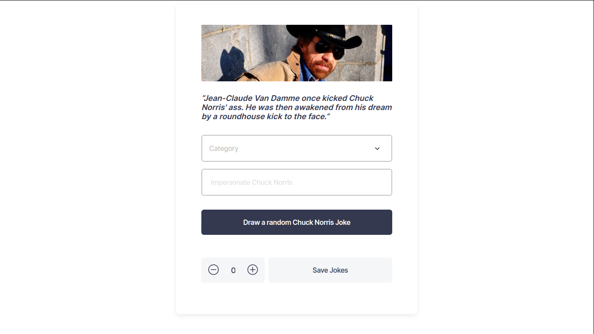

## Chuck Norris jokes

<h1 align="center">Chuck Norris</h1>
<div align="center">
  <h3>
    <a href="https://github.com/Betsimisaraka/chuck-norris-jokes">
      Source code
    </a>
    <span> | </span>
    <a href="https://chuck-norris-joke-anita.netlify.app/">
      Demo
    </a>
  </h3>
</div>

A MoodUp projects that fetch Chuck Norris jokes from an API.



### Build with

- [React](https://reactjs.org/)
- [HTML5](https://html.org/)
- [CSS](https://css.org)
- [Styled-Components](https://styled-components.org)

### Functionality

Every time the user access the page there is already a joke that display automaticaly.

By clicking "Draw a Chuck Norris joke" button the user will fetch another joke which displays randomly.

When the user choose a category from the dropdown and click the "Draw a Chuck Norris joke" button, the will be displayed according to the category that has been chosen.

Every time the "Impersonate Chuck Norris" input field value changed the text in the "Draw a Chuck Norris joke" button dynamically change to "Draw a <input_value> joke". When the user hit the button the new Chuck Norris joke is drawn and all of the "Chuck Norris" in the joke is replaced by the value from the input.

### How to use

To clone and run this application, you'll need [Git](https://git-scm.com), [Node.js](https://nodejs.org/en/download/) (which comes with [npm](http://npmjs.com)) and [parcel bundler](https://parceljs.org/getting_started.html) installed on your computer. Or you can run this with a live server. From your command line:

```bash
# Clone this repository
$ git clone https://github.com/Betsimisaraka/chuck-norris-jokes
# Install dependencies
$ yarn install
# Run the app
$ yarn start
# Bult the app
$ yarn build
# Test
$ yarn test
```

### Design

Design was provided by this [Zeplin](https://app.zeplin.io/project/60082e93b75072b9b22b0d74) file.

### Development Notes

- This project uses 3 React components:
  - The `Form` component is used to display the form with a select dropdown, an input field and a button.
  - `Header` component displays the images and the joke.
  - `SaveJokes` component displays an input with the increament and decreament buttons followed by a save button.
- Utils is used to store the `InitialSate`, `Reducer` and `Type` to separate the `Context` into smaller pieces.

- Context API is used to store the state and share every state accross the 3 components.

### Contact

GitHub [Betsimisaka](https://github.com/Betsimisaraka)
